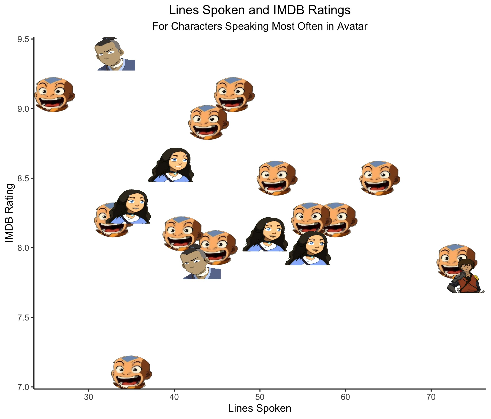
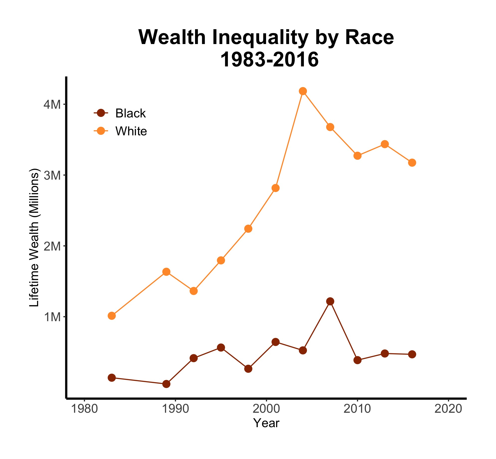
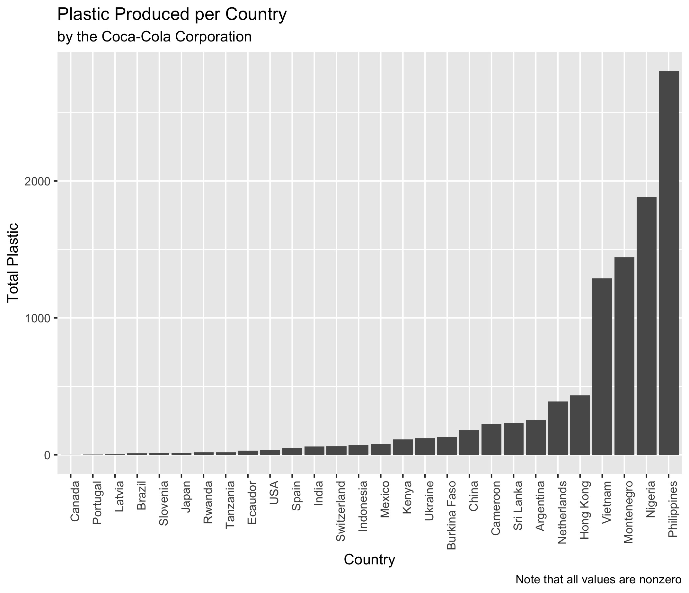

- During one meeting, Steph, Kim, and Andrea made this visualization using the [Avatar dataset](https://github.com/rfordatascience/tidytuesday/blob/master/data/2020/2020-08-11/readme.md). They compared how often each character spoke during each episode of Season 1 to the IMDB rating of the episode. 

```{r, echo = FALSE, out.width = "400px", fig.align='center'}

```

- Andrea looked at wealth inequality by race over time using [this Tidy Tuesday dataset](https://github.com/rfordatascience/tidytuesday/blob/master/data/2021/2021-02-09/readme.md).

```{r, echo = FALSE, out.width = "400px", fig.align='center'}

```

- Steph, Kim, and Andrea investigated the severity of [plastic pollution](https://github.com/rfordatascience/tidytuesday/tree/master/data/2021/2021-01-26) by the Coca-Cola corporation in different countries

```{r, echo = FALSE, out.width = "400px", fig.align='center'}

```

- Andrea made this [Shiny app](https://r.amherst.edu/apps/aboskovic21/tidytuesday_w12/) to visualize [dairy data](https://github.com/rfordatascience/tidytuesday/tree/master/data/2019/2019-01-29). Check it out!